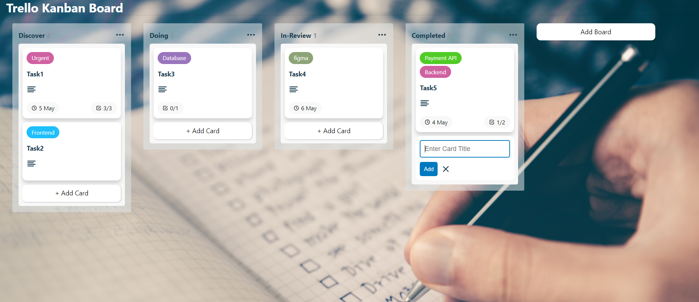
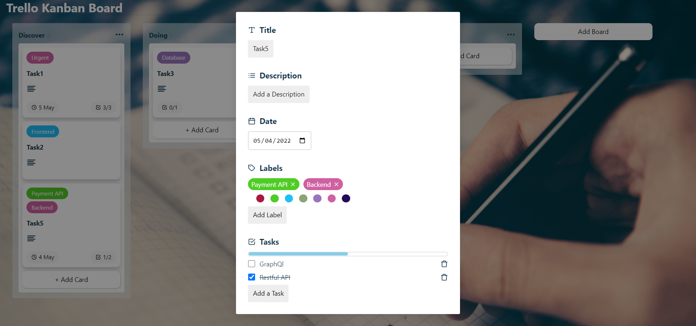

# TrelloKanban

Trello Kanban Board develop on ReactJs, React Feather, Local Storage and typescript where users can Manage Tasks using Trello Kanban Board.

## Demo Video

demo_video.mp4

## Demo Snapshots

# `Home/Dashboard Page`

# `Task Management`

## Installation and Setup Instructions

Install Node Js on your machine.

Install Pre-req Packages:

`npm install`

To Start App Server:

`npm start`

To Visit App Via Browser:

`http://localhost:3000`

# Future improvements

- API or Database Integration
- Projects Management
- Filters and Sorting
- User Management and Task Assignment
- Drag and Drop Column Base instead of Card Replace
